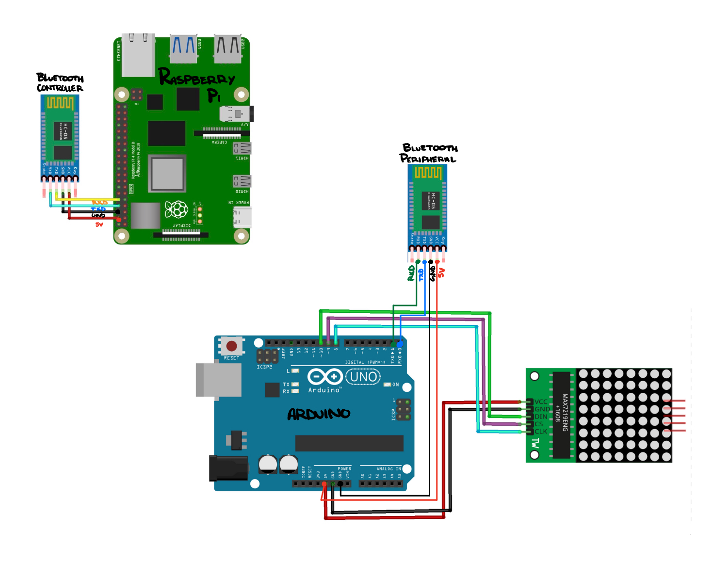

# Bromley_TrailMap
New interface for Bromley's trail map, ~~utilizing Feratel's hardware.~~
----------------------------------------------------------------------

https://www.youtube.com/watch?v=xSwoM3M24W8

Materials:
- Raspberry Pi 4B ($35+)
    - https://www.raspberrypi.com/products/raspberry-pi-4-model-b/
- 12 64x32 RGB LED Matrix - 4mm Pitch ($40/panel)
    - https://www.adafruit.com/product/2278 
- RGB Matrix Bonnet ($15)
    - https://www.adafruit.com/product/3211 
- 5V 4A (4000mA) Switching Power Supply ($15)
    - https://www.adafruit.com/product/1466 
- Female DC Power Adapter ($2)
    - https://www.adafruit.com/product/368 
- USB-C Power Cord
- Gigabit Ethernet Cable
- Micro SD Card
- Lots of Wires

Estimated Cost: $467 - $500

----------------------------------------------------------------------

V3 start date: 09/06/2025

----------------------------------------------------------------------
File Structure:

```text
.
├── csv/
│   ├── Lifts.csv
│   ├── Text.csv
│   ├── Trails.csv
│   └── csv_to_sqlite.py
├── fonts/
│   └── 7x13.bdf
├── static/
│   ├── closed.png
│   ├── delayed.png
│   ├── open.png
│   ├── style.css
│   └── unknown.png
├── templates/
│   ├── base.html
│   ├── help.html
│   ├── home.html
│   ├── lifts.html
│   ├── text.html
│   └── trails.html
├── textures/
│   └── Bromley_Schematic.jpg
├── README.md
├── app.py
├── bromley_trailmap.db
├── start_trailmap.sh
└── trailmap.service
```
Initial Steps:
- Reformat SD card to FAT32
- download raspberrypi OS
  - use customized setup options for host/username/password/wireless LAN
- set up network connectability (wifi)
- download rpi-rgb-led-matrix repository off of github
- create virtual environment within the pi 
  - allows you to download cython or any other necessary packages/parsers
- use sample files in rpi-rgb-led-matrix/bindings/python/samples to test panel
- copy font files locally if needed 
- sudo -E $(which python) runtext.py --led-cols=64 --led-gpio-mapping=adafruit-hat 
--led-slowdoen-gpio=4 --text="Welcome to Bromley!"

Rewrite Website Code:
- decrease calls 
- increase efficiency 
- integrate CLI with Flask


----------------------------------------------------------------------

V2 start date: 12/28/2024

----------------------------------------------------------------------

New Plan: Start over completely 
- make an entirely new website/user interface
- create and use a database to keep track of stats
- purchase 8+ 64x32 RGB LED Matrix Panels
- get necessary tech to connect to rasp pi
- no longer using arduino
- no longer using HC-05s

----------------------------------------------------------------------

'ssh <username>@raspberrypi.local'
‘sudo bluetoothctl’
Should say “Agent registered” and show you are inside the bluetooth
‘agent on’
Confirms by saying “Agent is already registered”
‘scan on’
Will scan for bluetooth devices and list their addresses
Copy address of HC-05
Ex: “98:D3:61:F7:14:36”
Enter ‘exit’ 
Get back to your RaspberryPi
Enter ‘sudo rfcomm bind 2 <address>’
This will “bind” the bluetooth

----------------------------------------------------------------------
Plan B:
- use 8x8 LED module with MAX72xx attachment to display check (open), x (closed), or square (delayed)
- use HC-05 bluetooth to talk between raspberrypi and arduino
- website: file:///Users/alexawitkin/CLionProjects/Bromley_TrailMap/templates/buttons.html
  - get ip address website (will be the one that updates with raspberrypi + arduino)

In Progress:
- get buttons.html to communicate with buttons.js
- ensure serial is transmitted to HC-05 and HC_05.ino works accordingly

Updated Schematic:



----------------------------------------------------------------------
Newest Idea:
- get a TTl to hook up the RS422 to the TTL and then the TTL to the Arduino
  - should allow for the translation of serial input/output without echo/excess
  - https://arduinogetstarted.com/tutorials/arduino-rs422
- 


----------------------------------------------------------------------
Info gathered with Pete:
- hook up ethernet in dell room to laptop
  - use wireshark to read into 2.39 (serial portion of feratel's stuff)
  - try BROM, feratel, cps!linux as the login
- hook up rs422 adapter directly into board behind sign
  - use ftdi usb driver and a Serial Port Monitor COM (most only work with windows)
- ALTERNATIVELY use additional cat6 ethernet cord to hook up to rs422 and laptop while keeping other wires untouched
  - this should allow for communication from serial inside to board outside to be undisturbed while viewing the communication on the laptop
    - can then watch how the serial feedback changes while altering the sign's display
- try to translate the serial recieved (modbus rtu)
  - https://www.wevolver.com/article/modbus-rtu-a-comprehensive-guide-to-understanding-and-implementing-the-protocol 

- rs422 inside L to R: brown, orange, green blue (TX, TX, RX, RX)
- rs422 outside L to R: green, blue, brown, orange (TX, TX, RX, RX)

----------------------------------------------------------------------
Example of serial recieved:

C 00 00b 00 00z 03 00 02 02 02rC 03 02 02 02 02Br 03C 00

08 02BBr#zC 08  00 02r 03 00 08 00"rCB 02 00zC 03 03 08 08 02

02b 03 02 02B 02 02zcx 03 08 02 02Bz 03 00 08" 02 02bkC!@J bC 03

00 00B 00 02z 03 08  02`cz 03 02 0cJ 02Bz 03C 08 08 02 02

02rC 00 02 02 02rS 03" 08 02rCBB 00 00r#xk 03 08 08" 02 00pC 00

00 02 08 02r 03 02 02 02 02rSC 02 02 08 02r 03 03 02

02 02 02 02pcz 03 02 02 02 02 02r 03 02 08 02 02 02r

03 02 00 02 02bSkC 01@ 02 02bC 02 08BB`c|C 00 00" 02 02zC 00 00

02 02z+ 03 00 08 02 00 02zS 03 00 * 00z 03 02 02 02 02

02z#z 03 00 08" 00 02zk 03 08 02 02` 03 00 00 02 02 02zSC

00 0c 02 02z 03 02 08 02 02z#zk 03 00 08 02 02 00z 03

02 00" 00Bz 03 08 0c@* 02bCCB 08* 02zk 03 02  02 02 02zcz 03 02

08 02* 02b 03 02 08 02 02z 03 00 02 02 02 02zSk 03 02

00 02 02 02zCB 02 0c 02 02z#z 03 02 08 02 02 02z 03 02

00 02* 02zk 03! 00 08 02 02bCC 08 02 00 00pC 00 0c 08 02r#z

03! 00 02 00 00r+C 00 00 02 02 02r 03 02 00B 02 02rS 03

08 00J 00r 03 02 02 02 02 02p#|k 03 00 00 02 02 00r 03

02 @* 02rC 08 08B 02rC 03 02 08 02 02p 03 03 02  02 02r#| 03

00 00* 02p 03 00 00B 08 02p 03 02 08 02 02pSkC 02 00 02

02 02pC 00 00 00Brc~ 03 00 00 02 02rC 00 0c 02 02 02rk 03

00 02 02 02 02rCC 08 08" 00 00rC" 02"`Br 03C 08 08 02 02 02r

0bC 00  02* 02rC 02 02 02rCC 00 00 00"rC 02 02 02"rczk 03 00 08

02r 03 00 B* 02r 03 00 08 02 02 02rCC 08 00 02 00pk 03 00

00* 02rczC 08 00J 02 02r 03 00 0c 02 02rC 08 08""rS 03C 00  02

08 02rC 02$ 02 02r#zC 08 00 00 00r 03 02 02"pk 03 02 0c 02*

02rC 03H 02 02 02 02r 03! 00 02 02rcz 03 08 02"rk 03 08 02

02rC 02 02 02 02 02rS 03 02 02 02 00r 03 02 08 00 02r#z

03 03 08 00 02 02Br 03 02 08 02"pCH 02 02 00pS 03! 00 00

02 02r 03C 00 0cJ 02Br#zC 00 08"p 03 00 00 02* 02r 03 00 02B

02rS 0bCH 02 02 02r 03 08 00 02 02 00rcz 03 02 00 02 02rCH

00J 02"rk 03 02 02 02 02rS


----------------------------------------------------------------------
**Notes:**

Cord in Port 21 (dell room)

DELL
- turn black box router off, then on
- Go to applications -> Firefox 
- Feratel media technologies AG CPS.net -BROM-Bromley SkiResort - Mozilla Firefox
- BROML, feratel, cps!linux

MAC
- ip: 192.168.2.38
- Admin login 
- BROML, bromley, bromley 
- Go into tools -> 
- Go into sources -> jquery -> external/jquery
- Buttons around lines 7650 in jquery-ui.js 
- Date/time around lines 7900
- Color animations around lines 13975
- Look through 

*Research how to use port forwarding to make specific ip address public 

----------------------------------------------------------------------

TRAILMAP PANNEL (115V -be careful-)
- uses an RS442 on board's X9 for communication to network/router(?)
- RS442 poinout:
  1. TXA
  2. TXB
  3. RXA
  4. RXB
  5. GND 
- RS442 Computer____to____R2442 Device
  - __ TXA+ _______ to ______ RXA+
  - __ TDB- _______ to ______ RXB-
  - __ RXA+ _______ to ______ TXA+
  - __ RXB- _______ to ______ TXB-
  - __ GND  _______ to ______ GND
(may need to swap +/- values, feratel is diff from US board)


- uses an RS442 on board's X8 for communication
- LEDI RS232 pinout:
  1. RA
  2. RB
  3. RX
  4. TX
  5. GND
 


--------------------------------------------------------------------------
Questions for James:
- How are things localized on the network?
  - ip addresses
- How do you access specific paths on specific routers?
  - Can that all be done through ip address?
  - ip addresses and serial input
- If I make a funcitoning website, can we give select people access to the network from anywhere?
  - yes, talk to firewall man (peter)
- When I used HC-05's for bluetooth I get its address and then I use rfcomm bind to bind the primary and secondary (main/sub)
  - How does that work on a larger scale such as with routers and networks?
    - serial input
    - leearn more about the feratel box downstairs
      - pretty sure it's the thing actually communicating with the sign
  
--------------------------------------------------------------------------

V1 start date: 8/24/2024
